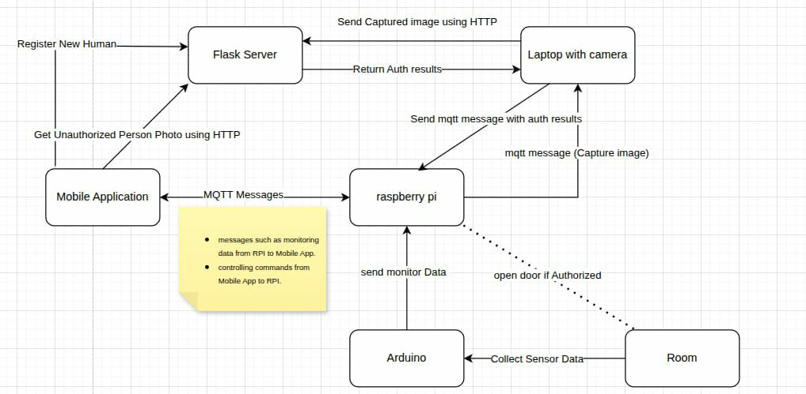

# Smart and Secure Room

A project to build a smart & secure room system combining Arduino, Raspberry Pi, computer vision, and a Flask server to enable monitoring, face recognition, and remote control/security features.

## Table of Contents

- [Overview](#overview)  
- [Features](#features)  
- [Architecture](#architecture)  
- [Repository Structure](#repository-structure)  
- [Requirements](#requirements)  
- [Setup & Installation](#setup--installation)  
- [Usage](#usage)  
- [Configuration](#configuration)  
- [Demo](#demo)
- [Application UI](#application-ui) 

  

## Overview

This system enables a **Smart and Secure Room** setup. Key functionalities include:

- Access control using face recognition  
- Real-time monitoring via camera  
- Remote server that communicates with embedded devices  
- Alerts or actions based on recognition or detected conditions  

You can combine Arduino (for sensors / actuators), a Raspberry Pi (for local processing), and a backend server (Flask) for control and data management.

## Features


- 🔒 Face recognition–based access control  
- 📷 Real-time video capture and monitoring  
- 🌡️ Sensor integration (temperature, humidity, motion, smoke, distance, etc.)  
- 🌐 Flask web server for control and logging  
- ⚙️ Serial communication between Raspberry Pi and Arduino  
- 💡 Automatic actions (lock/unlock, alerts)  
- ☁️ MQTT integration for remote data transmission  

## Architecture

Here’s a high-level view of how parts interact:

<p align="center">
  
</p>

## Repository Structure
├── Arduino_code.c # code running on Arduino
├── Flask_server.py # Flask backend server
├── pi_main.py # main script on Raspberry Pi
├── camera.py # camera capture / streaming code
├── faceRecognitionSystem.py # face detection / recognition module
├── shields.apk # Android app 
└── README.md #wiki
## Requirements

Here are the main dependencies and hardware you need:

### Hardware

- Arduino (e.g. UNO, Mega)  
- Raspberry Pi (with camera module)  
- Camera (compatible with Pi)  
- Sensors / actuators (e.g. door lock mechanism, sensors)  
- Power supply, wiring

### Software / Dependencies

- Python 3.x  
- Flask  
- OpenCV / dlib / face recognition libraries  
- Serial communication library (e.g. `pyserial`)  
- Any database (SQLite, MySQL, etc.)  
- Android SDK (if using the `.apk` / mobile interface)  

## Setup & Installation

Here is a minimal guide; please update with your specific steps:

1. **Clone the repo**  
   ```sh
   git clone https://github.com/Ahmed-Khaled-Abdelmaksod/Smart_and_Secure_Room.git
   cd Smart_and_Secure_Room

2. **Set up Python environment**
   ```sh
   python3 -m venv venv
   source venv/bin/activate
   pip install -r requirements.txt # install each module individully
3. **Arduino upload**

    - Open Arduino_code.c in Arduino IDE

    - Configure pins / settings as needed

    - Upload to your Arduino

4. **Configure Raspberry Pi / Local device**

    - Set up camera

    - Adjust pi_main.py, camera.py, faceRecognitionSystem.py if needed (paths, thresholds)

    - Ensure serial port settings for Arduino communication
5. **Start Flask server**
    ```sh
    python Flask_server.py
6. **Launch system**
    - Run pi_main.py on the Pi or local device
    - Use the server API / UI to control or monitor the system

## Software / Dependencies

- Python 3.x  
- Flask  
- OpenCV / dlib / face recognition libraries  
- Serial communication library (e.g. `pyserial`)  
- Any database (SQLite, MySQL, etc.)  
- Android SDK 
## Demo
- link -> https://drive.google.com/drive/folders/1N35sL85hpGIN7XXEDRhxZFkRaSAMwkd-?usp=sharing

## Application-UI